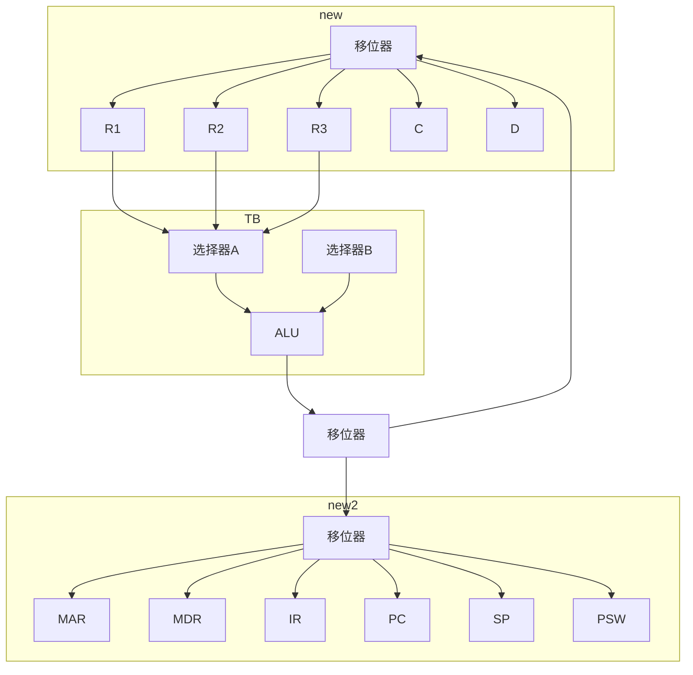

```mermaid
graph TB
a1[移位器]
a2[移位器]
a[移位器]
	subgraph TB
	选择器A-->b[ALU]
	选择器B-->b
	end
	b-->a
	a-->a1
	a-->a2
	subgraph new
	a1-->R1
	a1-->R2
	a1-->R3
	a1-->C
	a1-->D
	end
	subgraph new2
	a2-->MAR
	a2-->MDR
	a2-->IR
	a2-->PC
	a2-->SP
	a2-->PSW
	end
	R1-->选择器A
	R2-->选择器A
	R3-->选择器A
```

